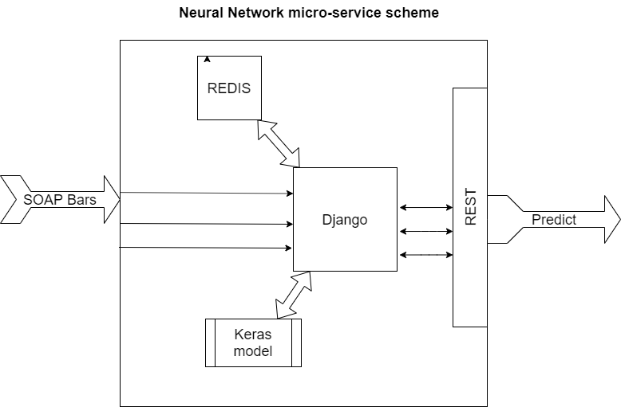

# Project Title

Neural Network backend for currency predict

## Scheme of micro-service



## Getting Started

These instructions will get you a copy of the project up and running on your local machine for development and testing purposes. See deployment for notes on how to deploy the project on a live system.

### Prerequisites

What things you need to install the software and how to install them

```
- Docker
- docker-compose
```

### Installing

A step by step series of examples that tell you how to get a development env running

## Install Prerequisites

```
https://docs.docker.com/install/
```

## Run docker containers. Execute command in root of project.
```
docker-compose up
```

## You can check your env by URL
```
http://127.0.0.1:8080/ai/fabric/USDRUB/
```

## You can change 'USDRUB' to another pair from SOAP
```
http://127.0.0.1:8080/ai/fabric/EURUSD/
```

## You must setting up cron in Any server with get URLs (by CURL or anything else) for caching it for any symbol

Any predict will be save in Redis cache. Next time you will get predict from cache
